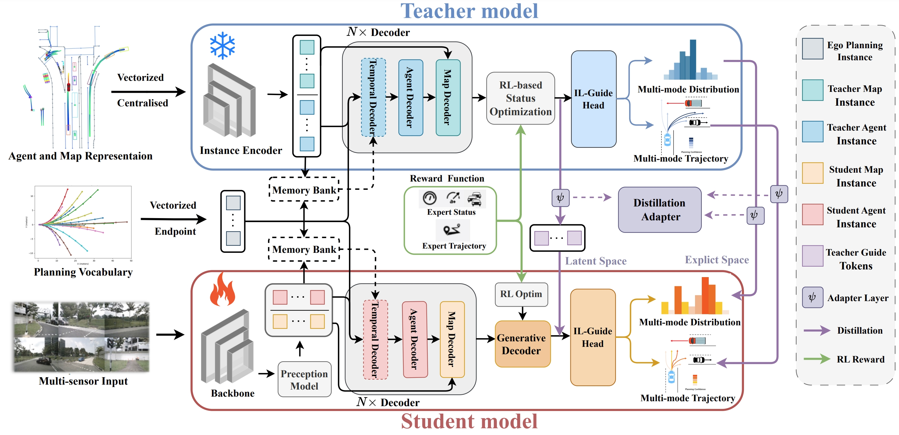

<h1>DistillDrive</h1>
<h3>End-to-End Multi-Mode Autonomous Driving Distillation by Isomorphic Hetero-Source Planning Model</h3>
<h3>Accepted to ICCV 2025!</h3>

## News
<!-- * **`24 , 2025`:** We reorganize code for better readability. Code & Models are released. -->
* **`Aug. 06, 2025`:** We release the SparseDrive paper on [arXiv](​https://arxiv.org/abs/2405.19620). 
* **`Jun. 26, 2025`:** DistillDrive is accepted to ICCV 2025!

## Introduction
> We introduce DistillDrive, an end-to-end knowledge distillation-based autonomous driving model that leverages diversified instance imitation to enhance multi-mode motion feature learning
- We propose a distillation architecture for multi-mode instance supervision in end-to-end planning, tackling single-target imitation learning limitations.
- We introduce reinforcement learning-based state optimization to enhance state-to-decision space understanding and mitigate ego motion state leakage.
- To address missing motion-guided attributes, we use a generative model for distribution-wise interaction between expert trajectories and instance features.
- We conduct open- and closed-loop planning experiments on the nuScenes and NAVSIM datasets, achieving a 50% reduction in collision rate and a 3-point increase in both EP and PDMS over the baseline.

## Acknowledgement
- [SparseDrive](​https://github.com/swc-17/SparseDrive)
- [Sparse4D](​https://github.com/HorizonRobotics/Sparse4D)
- [UniAD](​https://github.com/OpenDriveLab/UniAD) 
- [VAD](​https://github.com/hustvl/VAD)
- [StreamPETR](​https://github.com/exiawsh/StreamPETR)
- [StreamMapNet](​https://github.com/yuantianyuan01/StreamMapNet)
- [mmdet3d](​https://github.com/open-mmlab/mmdetection3d)

